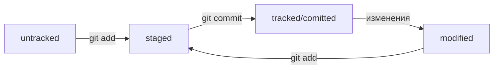

# Это шпаргалка по работе с Git и Git-Hub

## Навигация в командной строке 
* `pwd` - показать текущую директорию;
* `~` - домашняя директория;
* `..` - родительская директория;
* `.` - текущая директория;
* `ls` - отобразить содержимое директории (флаг `-a` покажет объекты с запрещёнными символами в названии:`ls -a` );
* `cd` - сменить директорию, после команды указать путь до нужной директории.

## Управление файлами в командной строке
* `touch` - создание файла (touch <название файла> <местоположение файла>);
* `cp` - копирование файла (синтаксис аналогичный touch);
* `mkdir` - создание директории (флаг `-p` - создать структуру директорий: `mkdir -p`);
* `mv` - переместить файл или директорию;
* `cat` - чтение файлов (только .txt);
* `rm` - удаление файла;
* `rmdir` - удаление дирректории (удаляет пустую директорию, для последовательного удаления всех элементов директории с последующим удалением самой директории: `rm -r`).

## Эффективная работа с коммандной строкой
* `&&` - разделитель между командами для множественного вызова (пример: `cd~ && ls -a` - переход к домашней директории и отображение её содержимого);
* Клавиши стрелок `↑` `↓` - обращение к ранее использованным командам;
* Клавиша `Tab` - автоматическое заполнение команды, двойной `Tab` - вывод списка доступных команд.

## Работа с Git: создание репозиториев, коммиты
* `git init` - сделать текущую папку репозиторием;
* `rm -rf .git` - разгитить папку (удалить скрытую папку .git);
* `git status` - проверить состояние репозитория;
* `git add` - подготовить файл к сохранению (используют флаг `--all` или `.` для сохранения сразу всех объектов в текущей директории);
* `git commit` - сделать коммит = сохранить изменения (с помощью флага `-m"<Сообщение коммита>"` можно добавить комментарий);
* `git log` - просмотр истории коммитов (флаг `--oneline` - получить сокращённый лог).
 
## Синхронизаия локального и удалённого репозиториев в Git-Hub
* `ssh-keygen` - генерация SSH пары (`ssh-keygen -t ed25519 -C"имя почты к которой привязан аккаунт"` **ИЛИ** `ssh-keygen -t rsa -b 4096 -C"имя почты к которой привязан аккаунт"`);
* `pbcopy` - копирование потока данных в буффер обмена;
* `ssh -T git@github.com` - проверить подлинность ключа;
* `git remote add` - привязать удалённый репозиторий к локальному (передаём в команде два параметра - имя удалённого репозитория `origin`, и его URL);
* `git remote -v` - убедиться, что репозитории связаны;
* `git remote rm origin` - удалить текущий `origin`;
* `git push` - отправить изменения на удалённый репозиторий.

## Хэши, лог, статусы файлов
__Хеш__ — основной идентификатор коммита.

__Свойства хеша:__

* Если дважды получить хеш для одного набора данных, результат будет одинаковым;
* Если изменить хоть что-то в исходных данных, хеш изменится;
* В сокращённом логе (git log --oneline) выводятся сокращённые хеши.

__HEAD__ - файл в директории .git, в котором записана ссылка на последний коммит, синоним хеша последнего коммита. 

__Статусы файлов в Git:__
* __untracked__(новые файлы, неотслеживаемые);
* __tracked__(отслеживаемые файлы);
* __staged__ - подготовленные после git add;
* __modified__ - изменённый, например файл закоммичен и после изменён. 

Ниже представлена схема статуса файлов: 

## Исправление коммитов
* `git commit --amend --no-edit` - дополнить коммит новыми файлами;
* `git commit --amend -m "Новое сообщение"` - изменить сообщение коммита;
    * Если не указывать у команды `git commit --amend` один из флагов (`--no-edit` или `-m`), Git предложит отредактировать сообщение коммита вручную. Для этого он откроет текстовый редактор, который установлен в системе по умолчанию.
* `git restore --staged file` - выполнить unstage изменений, переводит файл обратно в **mofidied** или **untracked**.
* `git reset --hard <commit hash>` - откатить коммит, вернуть состояние репозитория к более раннему (до коммита с указанным хешем);
* `git restore file` - откатить изменения в файле, которые не попали ни в staging, ни в commit, до последней сохранённой в коммите или staging версии.

## Сопоставление коммитов 
* `git diff` - сравнить последнюю закомиченную версию файла с текущей (modified/изменённой);
* `git diff --staged` - сравнить изменения в staged; 
* `git diff коммит1 коммит2` - сравнить изменения в коммитах с хешами 1 и 2 (как превратить состояние 1 в состояние 2);
* `echo "text"`- выводит на консоль то, что передано в качестве параметра;
* `echo "text" >> file` - запишет то, что передано в качестве параметра в указанный файл (file);
* `echo "text" > file` - запишет то, что передано в качестве параметра в указанный файл(file), **стирая его содержимое**.

## Игнорирование файлов в Git
__.gitignore__ - файл, содержащий список игнорируемых объектов или правила, по которым они игнорируются.Применяются только к новым untracked файлам. Может содержать:

* просто название файла;
* `*` - любая строка, включая пустую;
* `?` - один любой символ;
* `...` - один символ из списка в скобках, перечисление или диапазон;
* `/` - указывает на каталоги;
* `**` - похоже на ординарную звёздочку, с отличием в том, как они работают с вложенными папками - `**` может соответсвовать любому количеству таких папок, в том числе нулю, ординарная только одной;
* `!` - инвертирует правило в .gitignore, создаёт исключение;

Чтобы отобразить игнорируемые файлы, можно использовать ключ:`git status --ignored`
Сам файл .gitignore — это обычный файл в репозитории. 

## Работа с ветками в Git
* `git clone <ссылка>` - клонирование удалённого репозитория на локальный компьютер. Автоматически связывает локальный и удалённый репозитории;
* __Fork__ - это Git-Hub операция, создающая копию репозитория в аккаунте Git-Hub (изменения в форке не будут синхронизированы с исходным репозиторием);
* `git branch` - просмотр веток проекта; 
* `git branch <название_ветки>` - создать ветку;
* `git branch -a` - показать все известные ветки, как локальные (в локальном репозитории), так и удалённые (в `origin` на GitHub);
* `git branch -D <название_ветки>` - удалить ветку после объединения, с флагом `-d` - удалить ветку, только если она была полностью объединена с другой (две ветки стали частью одной истории);
* `git checkout <название_ветки>` - переключиться на другую ветку;
* `git checkout -b <название_ветки>` - создать ветку и сразу переключиться на неё;
* `git diff <название_ветки_1> <название_ветки_2>` - сравнить ветки;
* `~N` - отсчитывает от заданного коммита N коммитов назад во времени `~(без числа) == ~1`;
* `git merge <название_ветки>` - выполнить слияние веток;
* `git push -u origin <название_ветки>`отправить новую ветку в удалённый репозиторий и связать локальную ветку с удалённой, чтобы при дополнительных коммитах можно было писать просто `git push` без `-u`;
* `git push <название_ветки>` — отправить дополнительные изменения в ветку, которая уже существует в удалённом репозитории;
* `git pull` - "подтянуть" изменения текущей ветки из удалённого репозитория.

Если истории двух веток не «разошлись» и их коммиты выстраиваются в одну цепочку, эти ветки можно объединить в режиме **fast-forward**.

`git merge --no-ff <название_ветки>` - слияние **non-fast-forward**.

`merge.ff: git config [--global] merge.ff false` - отключить fast-forward, до тех пор, пока не вернёся настройка "как было".

Если отключить слияние в режиме fast-forward, вместо "перемотки" ветки Git создаст в ней **коммит слияния** (merge commit) — в обиходе его называют **merge-коммит** или **мёрж-коммит**.

В Git можно решить проблему «разошедшихся» веток (`rejected: non-fast-forward`) с помощью операции `rebase`. Эта операция позволяет изменить точку (коммит), от которой отделилась ветка.

`git push --force` - **форсированный пуш**, удалит разошедшийся коммит и запишет в удалённую ветку коммиты из локальной.
В очень редких случаях это уместная команда. Например, если кто-то нечаянно "сломал" удалённую ветку main, можно найти копию репозитория, в которой ветка main не "сломана", и использовать `git push --force` для восстановления ветки в `origin`.

## Модели веток
__Подходы:__

* __Feature branch workflow__ - простой и самый популярный вариант. Если коротко, в нём для каждого нового изменения создаётся новая ветка, которая позже вливается в `main` с помощью `git merge`.
    * Новая функциональность или исправление — новая ветка;
    * Когда код в feature-ветке готов, он вливается в main;
    * В main всегда рабочая версия без "недоделок".
* __Git flow__ - более сложный вариант. Подход похож на feature branch workflow, но в нём создаётся больше веток, а изменения (коммиты) делят на разные типы: исправление, новая функциональность и так далее. Разные типы коммитов попадают в разные ветки.
* __Trunk-based__ - популярный в больших компаниях подход, который обещает бо́льшую скорость работы в крупных командах.
Этот подход тоже похож на feature branch workflow. Главное отличие в том, что участники проекта вливают (merge) свой код в основную ветку максимально часто. Например, каждый день.

